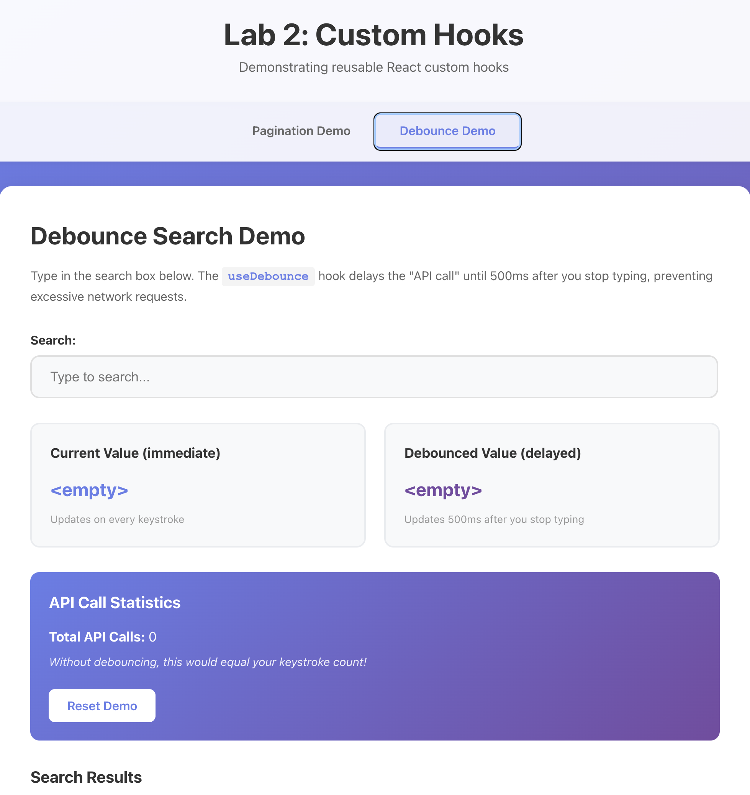

# Lab 2: Custom Hooks Implementation

This project demonstrates creating reusable React custom hooks from scratch. It implements two common patterns: pagination logic and input debouncing.



**Live Demo:** https://customhookz.netlify.app/

## Project Overview

The application showcases two custom hooks with interactive demo components that highlight their functionality and benefits. Built with React, TypeScript, and Vite.

## Custom Hooks Implemented

### 1. `usePagination` Hook

A comprehensive pagination hook that manages all state and calculations needed for paginating data.

**Parameters:**
- `totalItems`: Total number of items to paginate
- `itemsPerPage`: Items per page (default: 10)
- `initialPage`: Starting page (default: 1)

**Return Values:**
- `currentPage`: Current page number (1-based)
- `totalPages`: Total number of pages
- `startIndex`: Start index for array slicing (0-based)
- `endIndex`: End index for array slicing (0-based, exclusive)
- `itemsOnCurrentPage`: Actual number of items on current page
- `setPage(page)`: Jump to a specific page
- `nextPage()`: Go to next page
- `prevPage()`: Go to previous page
- `canNextPage`: Boolean indicating if next page exists
- `canPrevPage`: Boolean indicating if previous page exists

**Features:**
- Handles incomplete last pages correctly
- Boundary checking prevents invalid page numbers
- Computed values use `useMemo` for optimization
- Works with any array-based data

### 2. `useDebounce` Hook

A debouncing hook that delays updating a value until after a specified delay has passed without changes.

**Parameters:**
- `value`: The value to debounce (any type)
- `delay`: Debounce delay in milliseconds (default: 500ms)

**Return Value:**
- `debouncedValue`: The debounced value

**Features:**
- Prevents excessive function calls (e.g., API requests)
- Proper cleanup with `clearTimeout`
- Generic type support for any value type
- Ideal for search inputs, form validation, resize handlers

**Use Cases:**
- Search inputs - wait for user to finish typing before API call
- Form validation - validate only after user pauses
- Auto-save - save only after user stops editing
- Scroll/resize handlers - reduce performance impact

## Demo Components

### PaginationDemo
Interactive demo showing pagination in action with:
- 47 sample items paginated into 5 pages
- Current page information display
- Previous/Next navigation buttons (disabled at boundaries)
- Direct page number buttons
- Visual display of hook state

### DebounceSearchDemo
Interactive search demo demonstrating:
- Real-time vs debounced value comparison
- API call counter showing savings
- Simulated search results
- Visual loading states
- Hook state inspection

## Project Structure

```
src/
├── hooks/
│   ├── usePagination.ts        # Pagination custom hook
│   └── useDebounce.ts          # Debounce custom hook
├── components/
│   ├── PaginationDemo.tsx      # Pagination demo component
│   ├── PaginationDemo.css      # Pagination demo styles
│   ├── DebounceSearchDemo.tsx  # Debounce demo component
│   └── DebounceSearchDemo.css  # Debounce demo styles
├── App.tsx                     # Main app with tab navigation
└── App.css                     # Global styles
```

## Getting Started

### Installation
```bash
npm install
```

### Development
```bash
npm run dev
```

Visit `http://localhost:5173` to view the application.

### Build
```bash
npm run build
```

### Lint
```bash
npm run lint
```
